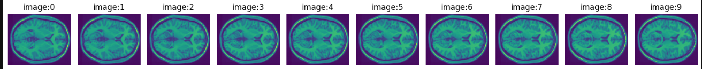
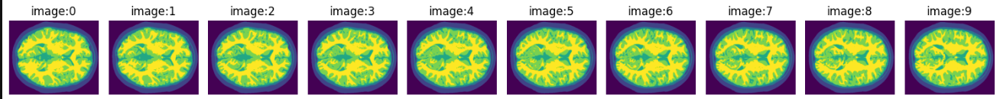
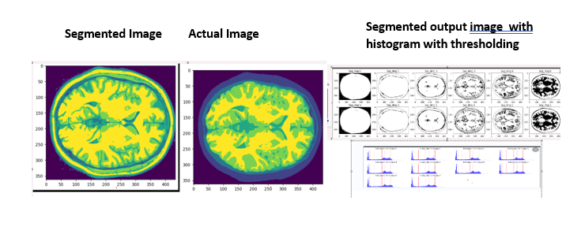

# Brain_Segmentation
University of Birmingham_Brain_Segmentation_2833155
# Brain MRI Tissue Segmentation

This repository contains the code, data, and report for a project focused on **tissue segmentation of brain MRI images**. The objective is to identify and segment five tissue layers from 2D axial slices and evaluate the accuracy of various segmentation techniques. Additionally, a 3D segmentation approach is implemented and compared to the 2D methods.

## Table of Contents
- [Overview](#overview)
- [Dataset](#dataset)
- [Methods](#methods)
- [Results](#results)
- [How to Run](#how-to-run)
- [Report](#report)
- [Interactive Visualization](#interactive-visualization)

---

## Overview
Segmenting brain MRI images into distinct tissue layers is crucial for medical imaging analysis. This project uses:
- **2D Segmentation**: Thresholding (manual and Otsu), K-Means clustering, and smoothing techniques.
- **3D Segmentation**: Extends the above methods to 3D slices to improve segmentation accuracy.

The results are evaluated using **pixel accuracy** and visual overlays against the provided ground-truth labels.

---

## Dataset
- **Input**: T1-weighted MRI images in `.mat` format with dimensions of `362x434x10`.
- **Labels**: Pre-segmented regions corresponding to air, skin, skull, CSF, gray matter, and white matter.
- **Sample Images**:
  - Input Image:
    
  - Ground Truth Labels:
    

---

## Methods
### 2D Segmentation:
1. **Thresholding**:
   - Manual Thresholding
   - Otsu Thresholding
2. **Thresholding with Smoothing**:
   - Gaussian, Sobel, and Canny Filters
3. **K-Means Clustering**:
   - Six clusters based on pixel intensities.

### 3D Segmentation:
1. **Thresholding with Smoothing**:
   - Extends 2D smoothing techniques to the 3D dataset.
2. **K-Means Clustering**:
   - Adapts K-Means for clustering across all slices simultaneously.

---

## Results
| Method                              | 2D Segmentation Accuracy | 3D Segmentation Accuracy |
|-------------------------------------|--------------------------|--------------------------|
| Thresholding + Gaussian + Sobel    | 67%                      | 69.44%                  |
| Thresholding + Gaussian + Canny    | 62%                      | -                        |
| K-Means Clustering                 | 52%                      | 56%                     |

**Visual Results**:
1. 2D Segmentation: Thresholding
   
2. 3D Segmentation: Thresholding vs. K-Means
   

---

## How to Run
1. Install the required libraries:
   ```bash
   pip install scipy matplotlib numpy

